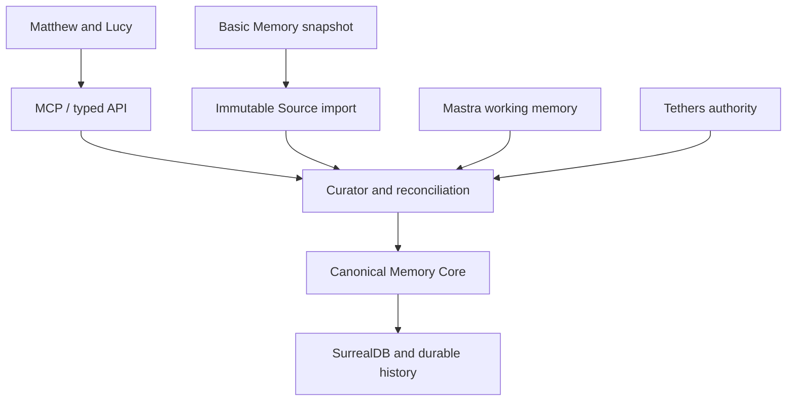

# Lantern Keeper Canonical Architecture

Status: implementation baseline, 12 September 2026

Lantern Keeper is the intended canonical shared memory between Matthew and
Lucy. Basic Memory Cloud is migration input and rollback reference during the
transition; it is not a permanent runtime dependency.

## Boundaries

| Component | Owns | Does not own |
| --- | --- | --- |
| Source | immutable observed/imported content and hashes | current truth |
| Claim/Memory | reconciled useful propositions, state and valid-time | original evidence |
| Derivation | lineage from claims/sources to summaries or conclusions | silent truth promotion |
| SurrealDB | persistence, indexes, relations and history | product judgement |
| Mastra | conversation/thread/working observations | canonical memory authority |
| Tethers | consequential authority such as destructive or protected operations | memory storage |
| MCP | semantic external capability contract | database CRUD |

## Current implementation

The Rust domain has `Source`, `Project`, `Episode`, `Marker` and `Memory`.
Memory reconciliation is deterministic for exact identity keys and explicit
confidence. It supports new, reinforcement, supersession, conflict,
historical, correction and ignore semantics without rewriting evidence.
Derived memories retain `derived_from` identifiers so later audit can locate
potentially stale descendants.

The SurrealDB adapter stores the complete serialized Memory payload alongside
indexed state, scope, kind and identity fields. Typed `memory_relation` records
retain relation type, source provenance and unresolved target text; a
`memory_event` trail records state-transition outcomes. This keeps export and
forensic inspection possible while allowing future schema evolution.

The HTTP API and `/mcp` JSON-RPC adapter expose semantic capabilities rather
than SurrealQL. AI runtimes may propose and search; canonical mutation is
performed by the reconciliation layer.

## Migration rule

Basic Memory Markdown is imported as Source evidence first. The importer uses
stable source fingerprints and `basic-memory:<permalink>` identity keys, so a
retry does not create an uncontrolled duplicate source estate. The first
promotion preserves the full note as a linked candidate, promotes recognised
bracketed observations as derived candidates, and records typed wiki-link
relations in a second pass. Unknown categories and unresolved targets remain
inspectable and replayable from the untouched Source.

No Basic Memory note is deleted by Lantern. Cutover requires snapshot
verification, restore proof, retrieval parity, shadow use and a final delta.
